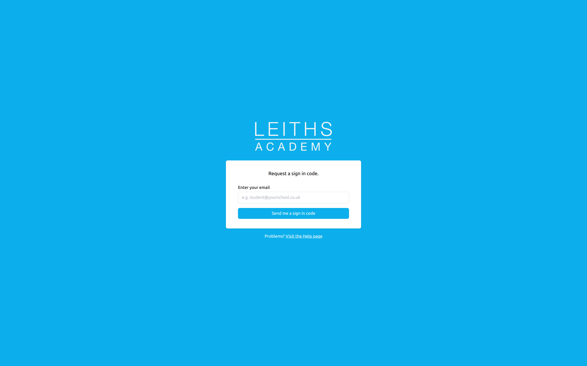

# School assessment portal
*FORMER CLIENT PROJECT - when I joined my current employer, I handed over this client to another team.*

This was a Svelte JS project built for a private client. A previous incarnation of this project was used for two years with the learnings from that project being used to build this one. This version was used for one academic year by several schools as a beta product before I left the project to pursue other opportunities. I was sad to leave this project and the people I was working with but it was time to move on..

## What does it show?
- Complete solution design to solve a client's problem, working directly with stakeholders
- User-interface design
- Full-stack web development (inc. full-stack Javascript)
- Database design and management
- Logging and debugging to identify hard-to-find issues
- Integration with third-party APIs

## What tech was used?

The previous project was build with a Svelte JS frontend and Craft CMS backend for both data storage and content management. While using Craft CMS for data storage had its advantages (namely you could make use of the out-of-the-box control panel for managing data), the admistrators were keen in the next iteration to benefit from the excellent UI we'd built for the students and the teachers.
### Frontend
Svelte JS with Tailwind CSS (and Tailwind UI) for styling. Sveltekit was later added for better routing and API support and security.
Netlify was used for deployment and hosting.

### Backend
Supabase for data storage and authentication.
Craft CMS for rich content management of course materials delivered via GraphQL, hosted on a Linode server with deployments done via Laravel Forge.

## Who was the client?
A leading UK cookery school. Students could log in to the portal to access their course materials, submit assignments and view their grades. Teachers would record their assessments and provide feedback. Administrators would oversee the whole process, manage visits to schools and provide support to students and teachers, including everything further assessments required for UCAS accreditation.

## Why?
Provide a portal with better UX than everything else in the education sector, helping the business cement it's IP in the private school sector before expanding into the state school sector. After receiving UCAS accreditation, the assessment needs were so different to the original portal, it was decided to build from scratch using everything we'd learned from before. There were three user groups:
### Administrators
- Add schools, add classes, set things up for the teachers and students
- Make higher-level assessments prior to accreditation
### Teachers
- Add students to classes, add assessments, provide feedback
- Request support from administrators
### Students
- View course materials, submit assignments, view grades
## Technical challenges

### Authentication 
We wanted to provide a far higher standard of UX than normally found in the education sector, and not requiring students to remember a password while maintaining a high level of security was a requirement. We initially went with the 'magic link' approach, where users request a login and be sent an email containing a direct login link. In the majority of cases, this worked beautifully and received a lot of praise. But some schools were finding it inconsistent.

After a lot of logging and calls with school IT staff, we realised some schools email scanners were following links in the emails and triggering triggering their one-time use, rendering them useless. The workaround was to switch to users receiving a one-time 6-digit password instead of a direct login link.

### Concurrent mutation of data
Teachers liked to have the portal open while students were completing their assessments and this would sometimes result in data overwrites when either side saved without refreshing after the other had made changes. Although never released, a proof of concept solution was built using Supabase's realtime subscriptions that prevented the teacher and a student working on the same screen where there was a danger of data being overwritten.

